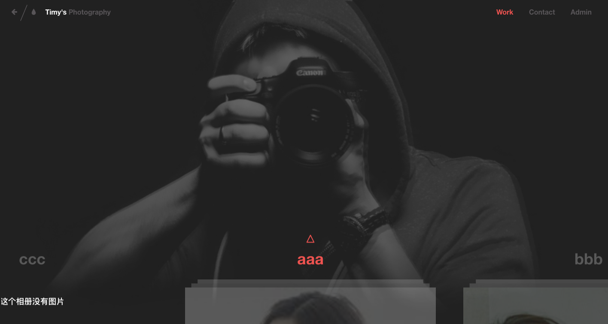
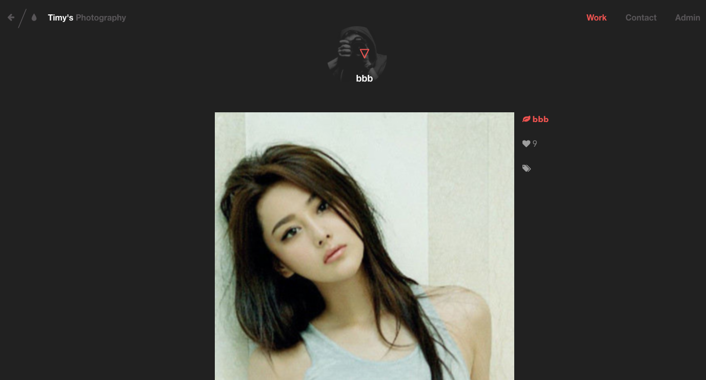

# photoview
django相册博客
---

# 知识点
> 1. 如何用django上传图片
> 2. 如何管理上传后的图片，删除、更新图片时，本地图片同时更新和删除

# 安装admin后台
```
pip install https://github.com/darklow/django-suit/tarball/v2
```

# 效果图

<首页>


<点击一个相册>

